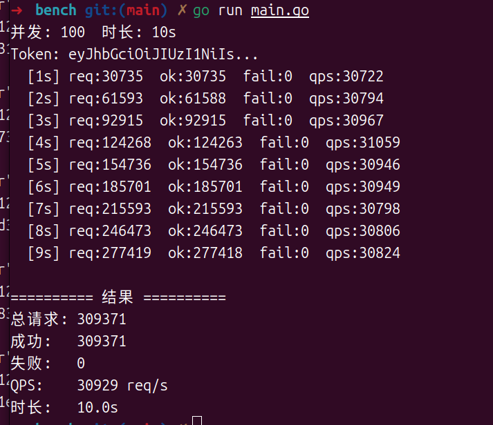

# Ticket — 分布式高并发抢票系统

基于 go-zero 微服务框架的票务平台。7 个服务，gRPC 通信，RabbitMQ 异步削峰，Redis Lua 原子库存扣减。

## 技术栈

| 层 | 技术 |
|---|------|
| 框架 | go-zero v1.10 + gRPC + GORM |
| 存储 | MySQL + Redis（Lua 原子脚本） |
| 消息队列 | RabbitMQ（异步建单 + 死信延迟取消） |
| 服务发现 | etcd |
| 安全 | bcrypt + JWT 双角色（用户 / 管理员） |

## 项目结构

```
Ticket/
├── common/
│   ├── xerr/             # 统一错误码 + gRPC 拦截器
│   ├── response/         # 统一 HTTP 响应 {code, msg, data}
│   └── mq/               # RabbitMQ 封装（exchange/queue/routing key）
├── internal/
│   ├── pkg/db/           # MySQL 连接 + AutoMigrate
│   ├── pkg/jwt/          # JWT 签发
│   └── redis/            # Redis 客户端 + Lua 脚本 + 限流 + 幂等 + 分布式锁
├── app/
│   ├── user/             # 用户服务 (API)
│   ├── admin/            # 管理端 (API)
│   ├── event/            # 活动服务 (API + RPC)
│   ├── inventory/        # 库存服务 (API + RPC)
│   ├── order/            # 订单服务 (API + RPC)
│   ├── ticket/           # 票务服务 (API + RPC)
│   └── payment/          # 支付服务 (RPC)
└── Makefile
```

## 服务架构

```
                        客户端
                          │
         ┌────────────────┼────────────────┐
         ▼                ▼                ▼
    user-api         event-api        order-api
    admin-api       inventory-api     ticket-api
         │                │                │
         └────────────────┼────────────────┘
                          │ gRPC
         ┌────────────────┼────────────────┐
         ▼                ▼                ▼
    user-rpc         event-rpc         order-rpc ←→ RabbitMQ
    admin-rpc       inventory-rpc      payment-rpc
    ticket-rpc
         │                │                │
         └────────────────┼────────────────┘
                          │
                    MySQL + Redis + etcd
```

## 核心设计

### 1. 抢票链路（buy 接口）

```
POST /api/v1/order/buy
  → 1. 三层限流（用户固定窗口 + 票种令牌桶 + 分布式锁）
  → 2. 幂等检查（Redis idem key，相同 requestId 返回同一订单）
  → 3. EventRpc.GetTicketType + GetEvent（票价 + 活动状态校验）
  → 4. 用户限购校验（已购 + 本次 ≤ MaxPerUser）
  → 5. InventoryRpc.DeductStock（Redis Lua 原子 DECRBY，0 超卖）
  → 6. 预生成 orderNo（UUID），发 RabbitMQ 异步建订单
  → 7. 立即返回 orderNo → 客户端直接调支付
```

### 2. Redis Lua 原子脚本

| 脚本 | 作用 | 为什么是核心 |
|------|------|------------|
| `DeductStockLua` | GET + 校验 + DECRBY 一步完成 | 避免"读-判-写"竞态，保证 0 超卖 |
| `UnlockLua` | GET 比对 value + DEL | 防止锁超时后误删他人锁 |
| `RateLimitLua` | INCR + 首次设 TTL + 限流判断 | 一次往返完成限流，少两次网络 I/O |
| `TokenBucketLua` | HMGET + 令牌补充 + 消耗 | 平滑限流，支持突发流量 |

### 3. RabbitMQ 异步削峰

```
buy API（低延迟）                    order-rpc（异步消费）
     │                                    │
     │ 扣库存后发消息 ──→ order.create.queue ──→ handleCreateOrder
     │                                    │
     │ 立即返回 orderNo                    ├── DB.Create(Order)
     │                                    ├── 幂等标记 Success
     │                                    └── 发超时闹钟 → order.timeout.queue
```

**为什么用 MQ**：扣库存是 Redis 操作（<1ms），建订单是 MySQL INSERT（~5ms）。高并发时 MySQL 连接池是瓶颈。异步化后 API 层只等 Redis，吞吐量翻 10 倍。

### 4. 超时取消（死信队列延迟消息）

```
order.timeout.queue                     dead_queue
（无消费者，消息躺 15 分钟）           StartTimeoutConsumer
     │                                    │
     │ TTL 到期 → RabbitMQ 自动路由 ──→   │
     │                                    ├── 查订单 status
     │                                    ├── unpaid → 取消 + ReleaseStock
     │                                    └── paid → 跳过
```

**为什么不用 cron 扫表**：延迟消息是闹钟模式——到点通知，只查这一条订单。cron 是扫全表模式——每轮扫所有 unpaid 记录，DB 压力大且不实时。

### 5. 安全机制

| 机制 | 实现 | 解决的问题 |
|------|------|-----------|
| **三层限流** | 用户固定窗口 + 票种令牌桶 + 分布式锁串行化 | 恶意刷单、突发流量、并发重复 |
| **幂等** | requestId → Redis idem key，15 分钟窗口 | 网络重试不重复创建订单 |
| **分布式锁** | Redis SETNX，用户+票种粒度，Lua 安全释放 | 同一用户对同票种串行，防并发重复 |
| **超时取消** | RabbitMQ 死信队列，15 分钟未支付自动回滚 | 不支付不占库存 |
| **库存原子性** | Redis Lua DECRBY，单线程执行 | 0 超卖 |

### 6. 错误处理体系

```
OK = 200
1xxxxx  全局（100001 服务错误 / 100002 参数错误 …）
2xxxxx  用户（200001 用户不存在 / 200002 密码错误 …）
3xxxxx  活动（300001 活动不存在 / 300002 名称不能为空 …）
4xxxxx  票务（400001 票不存在 / 400002 验票失败 …）
5xxxxx  库存（500001 库存不足 / 500002 初始化失败 …）
6xxxxx  订单（600001 订单不存在 / 600006 重复提交 …）
7xxxxx  支付（700001 支付失败 / 700003 重复操作 …）
```

gRPC 拦截器自动将 `*CodeError` 映射到标准 gRPC Status Code（NotFound / InvalidArgument / AlreadyExists / ResourceExhausted …），API 层统一返回 `{code, msg, data}`。

## 性能测试

### 压测环境

- CPU: Intel i7-12700H / OS: Ubuntu 22.04
- 工具: Go 自研压测程序（`test/bench/`）
- 所有服务 + MySQL + Redis + RabbitMQ + etcd 同机运行

### 吞吐量

| 场景 | 并发 | QPS | 错误率 |
|------|------|-----|--------|
| 单用户 | 50 | 31,066 | 0% |
| 单用户 | 200 | 29,981 | 0% |
| 单用户 | 500 | 28,737 | 0% |
| 三进程 × 500 | 1,500 | 32,400 | 0% |
| 100 用户 × 5 goroutine | 500 | 29,467 | 0% |

单机 3 万 QPS 天花板，瓶颈在 go-zero 网关 CPU。水平扩展线性增长。

### 正确性验证

| 测试 | 库存 | 结果 |
|------|------|------|
| 200 人抢 50 张票 | 50 | ✅ 精准卖出 50，0 超卖 |
| 101 人抢 100 张票 | 100 | ✅ Redis 库存 100→0，未穿透负数 |

防护措施全部生效——用户限流、票种令牌桶、分布式锁、幂等键、限购校验。多余请求在半路被拦截，压力不透传至库存层。

## 快速启动

```bash
# 前置依赖
docker run -d --name rabbitmq -p 5672:5672 -p 15672:15672 \
  -e RABBITMQ_DEFAULT_USER=admin -e RABBITMQ_DEFAULT_PASS=123456 \
  rabbitmq:3-management
# MySQL + Redis + etcd

# 启动
make start          # 全量启动所有服务
make build          # 编译检查
```

## 数据模型

### Redis Key 设计

```
stock:ticket:{ticketTypeId}                         # 库存（Lua 原子）
lock:order:{userId}:{eventId}:{showId}:{ticketTypeId} # 分布式锁
idem:{userId}:{eventId}:{showId}:{ticketTypeId}:{requestId} # 幂等
limit:buy:user:{userId}                              # 用户限流
bucket:ticket:{ticketTypeId}                         # 令牌桶
```

### MySQL 核心表

- **User** — 用户（bcrypt 密码 + user/admin 双角色）
- **Event** — 活动（draft → ready → selling → closed）
- **Show** — 场次
- **TicketType** — 票种（价格 / 库存 / 限购数）
- **Order** — 订单（unpaid → paid / cancelled）
- **Ticket** — 出票记录（QRCode + 实名）

完整表结构见各服务 `model/` 目录。


## 测试

```bash
# 功能测试
bash test/idempotent_lock_test.sh    # 幂等 + 分布式锁
bash test/ratelimit_test.sh          # 三层限流

# 端到端
bash test/test.md                    # 全接口 curl 手册

# 压测
cd test/bench && go run main.go -c 100 -d 10s
```

